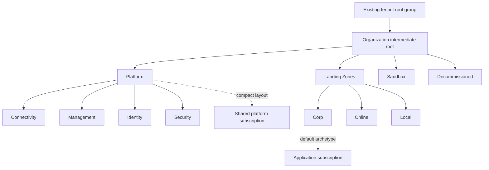

# ELZ — Enterprise Landing Zone

Deploy a tenant-wide Azure foundation from Bicep: management groups, platform and application landing zones, subscription placement, policy, Entra security groups, and group-based RBAC. Designed for a **greenfield Entra tenant in Azure public cloud**, with **no standing-charge services deployed by default**.

[](https://portal.azure.com/#create/Microsoft.Template/uri/https%3A%2F%2Fcdn.jsdelivr.net%2Fgh%2Fshadowarmor%2Felz%40cf1dd4a82f1fc06e4589da847314d6c936d57a20%2Fazuredeploy.json)
[](https://github.com/shadowarmor/elz/actions/workflows/validate.yml)

**Before clicking:** [complete the one-time tenant bootstrap](docs/bootstrap.md). You need **two existing empty Azure subscriptions**, permission to deploy at tenant scope `/`, and **Entra group-write privileges** for the default security-group creation. Azure Owner alone cannot create directory groups; Entra Global Administrator alone cannot deploy tenant-level Azure resources. The template cannot create an Entra tenant, grant its own starting permissions, or obtain a billing agreement.

## Deploy from the portal

1. Sign into the target directory in [Azure Portal](https://portal.azure.com). Complete [bootstrap](docs/bootstrap.md), including resource-provider registration.
2. Click **Deploy to Azure** above. This opens a **tenant-scoped** custom deployment; the deployment metadata location and the resource `Location` parameter are separate choices.
3. Enter an organization prefix, a platform subscription ID, a **different** application subscription ID, region, Owner, and CostCenter. Defaults create the compact layout below. Check the directory displayed by the portal before submitting.
4. Optionally supply separate management, identity, security, and nonproduction subscription IDs. **Every explicit subscription ID must be unique.** Leave optional platform IDs blank to share the platform subscription.
5. Keep the default nonoverlapping network ranges or provide private IPv4 networks of `/16` through `/24`. If setting Allowed Locations, include the resource Location. Leave **Create Security Groups = true** and the existing-group fields blank to create the required groups. Optionally supply owner/member **object IDs** or existing security groups. [Group names and access](docs/security-groups.md). Two Cloud Adoption Framework options default to off: **Configure Hierarchy Settings** makes Sandbox the default group for new subscriptions and requires authorization to create management groups under the tenant root; **Enable Activity Log Collection** adds one pay-as-you-go Log Analytics workspace that receives every placed subscription's activity log at no ingestion charge.
6. Select **Review + create**, inspect validation, then **Create**. After completion, use deployment outputs and the [verification guide](docs/operations.md) to check hierarchy, policies, networks, and access.

One deployment orchestrates the platform and application scaffolds. Input checks run first, then Entra group creation, and only then the management groups: a Graph permission failure (the step whose client support differs between portal and CLI) stops the deployment before any Azure resource exists. All modules are embedded in the committed ARM JSON; Azure does not need Bicep, a private registry, GitHub credentials, or deployment scripts. The buttons download the public template through jsDelivr, pinned to verified template commit `cf1dd4a82f1fc06e4589da847314d6c936d57a20`. This avoids the GitHub raw-content endpoint that returned HTTP 503 during portal downloads. [Updating the pinned templates](docs/operations.md#updating-and-redeploying).

## What gets created



| Area | Scaffold |
| --- | --- |
| Organization | 12 management groups under the existing tenant root; no changes to tenant-root policy or default subscription placement settings |
| Platform | Connectivity, management, identity, security resource groups; isolated hub VNet with two NSG-protected subnets |
| Applications | Production network and workload resource groups; isolated VNet and two subnets; optional nonproduction subscription with the same structure |
| Compliance | Microsoft cloud security benchmark, CIS Azure Foundations v3.0.0, and NIS2 assignments inherited from the intermediate root |
| Guardrails | Restrict classic resources; optional allowed resource regions; audit missing/empty RG ownership tags; restrict public IP resources in Corp |
| Access | Creates Platform Contributor and root Reader + Security Reader groups, plus separate production/nonproduction application Contributor groups on workload RGs only |
| Optional (off by default) | Tenant hierarchy settings: Sandbox as default group for new subscriptions, authorization required for new root-level management groups. Activity-log collection: one pay-as-you-go Log Analytics workspace in the management resource group receiving each placed subscription's activity log |

**Compact:** two subscriptions. The shared platform subscription sits under **Platform**; all four platform resource groups are in it. The application subscription sits under **Corp** or **Online**.

**Separated:** supply management, identity, and security subscription IDs; the original platform subscription becomes **Connectivity**. Each platform subscription then sits under its corresponding child management group. An optional nonproduction subscription brings this layout to six subscriptions. Partial splits are supported; the shared subscription stays under Platform until all three optional platform services have dedicated subscriptions.

The Sandbox, Decommissioned, and Local management groups are governance placeholders. No subscription is moved into them automatically. Decommissioned placement does not delete or cancel anything. This is a custom scaffold aligned with the Azure landing zone hierarchy, not the complete Microsoft ALZ accelerator policy library.

Security groups use names `sg-<prefix>-platform-admins`, `sg-<prefix>-security-readers`, `sg-<prefix>-application-prod-contributors`, and, when nonproduction is enabled, `sg-<prefix>-application-nonprod-contributors`. They are ordinary static security groups with no premium-license feature enabled. **No members are added unless explicitly supplied.** Members and owners are appended, preserving existing membership on redeployment. Existing groups supplied by ID are reused without changing their directory properties or membership.

## Policy and cost behavior

The three compliance initiatives use **`DoNotEnforce`**: Azure evaluates compliance without blocking deployments or automatically changing resources. Managed identities are created for compatibility with constituent policies, but receive **no remediation permissions**. The custom guardrails use `Deny` by default (or `Audit` if selected); RG tag checks always audit. [Policy details and pinned identifiers](docs/policy.md).

These assignments provide partial technical control mappings. They **do not establish CIS or NIS2 compliance** and do not configure Entra MFA, Conditional Access, incident response, organizational processes, or host hardening. Some controls need paid capabilities, manual evidence, or running workloads and will remain noncompliant, unknown, or not applicable.

By default the template creates no compute, storage accounts, Log Analytics workspaces, Sentinel, paid Defender plans, Azure Firewall, NAT/VPN gateways, public IPs, private DNS zones, private endpoints, or VNet peerings. Governance, resource groups, VNets, and NSGs form the initial scaffold. With **Enable Activity Log Collection** on, one pay-as-you-go workspace is added: activity-log ingestion and its 90-day retention are free, and anything else sent to that workspace later is billed per GB. Future workloads, data transfer, monitoring, remediation, and enabled services can incur charges. [Cost boundaries](docs/operations.md#cost-boundaries).

**Networks intentionally start isolated:** both subnet directions deny traffic, subnet private-endpoint network policies are enabled, and default outbound access is disabled. There is no hub/spoke peering or egress route. Add approved rules and connectivity before deploying workloads. Empty management, identity, and security resource groups reserve ownership boundaries; they are not running services.

## Command-line deployment and development

Requirements: Azure CLI, Python 3.10+, PowerShell 7 for the helper scripts; **Bicep 0.47.16** to reproduce committed JSON.

```powershell
git clone https://github.com/shadowarmor/elz.git
cd elz
az bicep install --version v0.47.16
./scripts/build.ps1 -Check
Copy-Item examples/compact.parameters.json examples/deployment.local.json
# Edit deployment.local.json with the target tenant's subscription IDs and settings.
az login --tenant '<tenant-guid>'
python scripts/preflight.py --parameters examples/deployment.local.json --online --tenant-id '<tenant-guid>'
./scripts/deploy.ps1 -TenantId '<tenant-guid>' -ParametersFile examples/deployment.local.json -Mode Validate
# Review the group owners/members and RBAC configuration before deployment.
# Microsoft Graph resources are not supported by ARM what-if.
./scripts/deploy.ps1 -TenantId '<tenant-guid>' -ParametersFile examples/deployment.local.json -Mode Deploy
```

`preflight.py --online` performs read-only checks for a fresh deployment. It rejects populated subscriptions; use normal offline preflight plus ARM validation and configuration review for intentional redeployments. It does not replace ARM validation or prove group-write authorization. Microsoft Graph what-if is unsupported; do not treat it as a preview of group or membership changes. If the portal reports Graph authentication/privilege errors, use the documented [Azure CLI/PowerShell deployment path](docs/security-groups.md#authentication-and-portal-behavior) with the same template and required directory permissions.

`infra/main.bicep` is the tenant entry point; `infra/platform.bicep` and `infra/application.bicep` are reusable building blocks. The [separated example](examples/enterprise.parameters.json) covers dedicated platform subscriptions. The application module can also deploy into an already governed subscription:

[](https://portal.azure.com/#create/Microsoft.Template/uri/https%3A%2F%2Fcdn.jsdelivr.net%2Fgh%2Fshadowarmor%2Felz%40cf1dd4a82f1fc06e4589da847314d6c936d57a20%2Fapplication.azuredeploy.json)

That second button creates application resource groups, networking, and the application contributor security group at subscription scope. It does **not** create management groups, move the subscription, or establish platform governance; place the subscription under the intended ELZ group first. Review existing policies and nonoverlapping CIDRs before use. Supply an existing application group ID to reuse one, or leave it blank to create the group.

## Documentation and validation

- [Tenant bootstrap and permissions](docs/bootstrap.md)
- [Security groups, owners, members, and RBAC](docs/security-groups.md)
- [Policy catalog, enforcement, and compliance boundaries](docs/policy.md)
- [Operations, verification, troubleshooting, and extensions](docs/operations.md)
- [Architecture decisions and Microsoft Learn sources](docs/architecture.md)

Both entry points compile with Bicep 0.47.16 and the pinned Microsoft Graph v1.0 extension 1.0.0. CI checks compiled JSON consistency, isolation and cost boundaries for both templates, fail-fast ordering, identifier validation, opt-in gating of every optional resource type, group defaults and membership preservation, RBAC wiring, policy settings, and valid/invalid parameter scenarios. **No live Azure/Graph deployment has been run against a target tenant.** Target-tenant ARM validation and acceptance testing are required; Graph resources are not supported by what-if.
